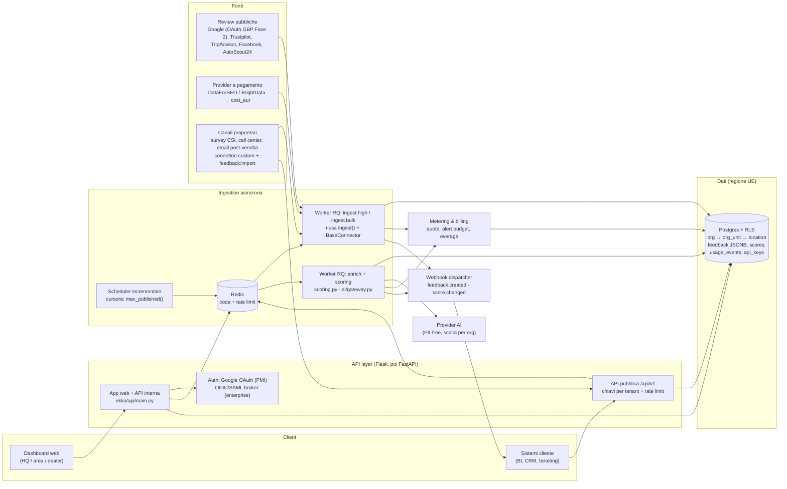

# Ekko — Architettura Fase 3 "Enterprise"

**DOBY SRL · Documento di architettura · v1.0 · Agosto 2026**

Questo documento definisce l'evoluzione architetturale di Ekko per servire clienti enterprise con reti di centinaia o migliaia di sedi (esempio tipo: Stellantis con la propria rete di concessionari). Parte dallo stato reale del codice — monolite Flask + sqlite3 su Render (`render.yaml`: 1 worker gunicorn, piano free), connettori in `ekko/connectors/`, scoring deterministico in `ekko/core/scoring.py`, gateway AI multi-provider in `ekko/ai/gateway.py`, multi-tenancy a un livello (`owner_id` in `ekko/storage/db.py`) — e tiene conto della Fase 2 in sviluppo parallelo (OAuth Google Business Profile, download gratuito delle recensioni dei profili posseduti, risposte AI in bozza con approvazione in dashboard).

Principio guida: **non si riscrive nulla che già funziona**. Il `FeedbackObject` v1 (`ekko/core/models.py`), l'interfaccia `BaseConnector` con corsie legali e `cost_eur`, la formula Ekko Score versionata e la pipeline `ingest()` restano i contratti stabili. La Fase 3 cambia *dove girano* (worker asincroni, Postgres) e *chi li governa* (organizzazioni, RBAC, metering), non *cosa fanno*.

---

## 1. Visione e casi d'uso enterprise

Il cliente enterprise tipo è un gruppo (automotive, retail, hospitality) con una rete di sedi giuridicamente o commercialmente collegate: nel caso Stellantis, migliaia di concessionari multi-brand (FIAT, Peugeot, Jeep, ...) organizzati per area geografica e per market. I casi d'uso che l'architettura deve abilitare:

1. **Gestione centralizzata, viste gerarchiche.** L'headquarters vede lo score aggregato di rete; l'area manager vede la sua zona; il dealer vede solo la propria sede. Il codice ha già i semi di questo modello: `BusinessRef` gestisce gruppi multi-sede (`dfs_tasks`, `ta_tasks`, `fb_tasks`, `autoscout24_urls` — una task per sede) e `FeedbackObject.location` traccia la sede di provenienza. Oggi però il "gruppo" è un artificio dentro una singola azienda; in Fase 3 diventa una gerarchia di prima classe.
2. **Confronto e ranking interno.** Classifiche dealer per Ekko Score, per trend 90gg, per tasso di risposta — tutte metriche che `ScoreBreakdown` (`ekko/core/scoring.py`) già calcola per singola azienda e che vanno aggregate per nodo della gerarchia.
3. **Feedback oltre le review pubbliche.** Survey CSI post-vendita, verbatim del call center, email post-intervento officina. Questi canali entrano dallo stesso imbuto delle review: un connettore che emette `FeedbackObject`. L'enum `Source` acquisisce valori `SURVEY_CSI`, `CALL_CENTER`, `EMAIL_POSTSALE` con relativi `SOURCE_WEIGHTS` (i canali proprietari sono verificati per costruzione: peso alto, es. 0.95). Il campo `Lineage.license` distingue già `official_api | licensed_provider | public_crawl`; si aggiunge `first_party`.
4. **Chiusura del loop.** La Fase 2 introduce risposte AI in bozza con approvazione: in ambito enterprise il flusso diventa un workflow con policy per brand (tono di voce, escalation su `Urgency.CRISIS`, approvazione a due livelli per sedi sensibili).

---

## 2. Multi-tenancy evoluta: organizzazioni, team, sedi

### 2.1 Modello

L'attuale isolamento è una colonna `owner_id` su `businesses` con filtro in `list_businesses()` e verifica in `_require_owner_of()` (`ekko/api/main.py`). Funziona per agenzie con pochi clienti; non regge una gerarchia. Il modello target:

```
Organization (Stellantis)
 └─ OrgUnit (albero: brand / area / market — ricorsivo)
     └─ Location (sede/dealer) ── 1:1 con l'attuale BusinessRef
Team (insieme di utenti) ──n:m── OrgUnit, con un Role
User ──n:m── Team
```

`Location` mantiene la compatibilità: ogni sede *è* un `business` odierno, con i suoi profili esterni (place_id, pagina Facebook, URL AutoScout24). La colonna `owner_id` viene sostituita da `org_id` + `org_unit_id`; le tabelle `feedback` e `scores` acquisiscono `org_id` denormalizzato per query e isolamento efficienti.

### 2.2 RBAC

Ruoli minimi: `org_admin` (gestisce struttura, utenti, billing), `area_manager` (lettura+risposta sul sottoalbero assegnato), `location_manager` (una sede), `analyst` (sola lettura), `api_client` (principal non umano per le chiavi API, §5). L'autorizzazione è una funzione pura `can(user, action, resource)` valutata sul sottoalbero: sostituisce il decoratore `login_required` + `_require_owner_of` con un decoratore `require(action)` che risolve la risorsa dalla route. Le policy vivono in tabella, non nel codice.

### 2.3 SSO

Il login attuale è "Accedi con Google" (`ekko/auth/google_oauth.py`, `users.id` = `sub` Google). Per l'enterprise serve SSO federato: **OIDC** come protocollo primario e **SAML 2.0** per gli IdP legacy (Azure AD/Entra, Okta, ADFS). Decisione: non implementare SAML in casa ma delegare a un broker (Keycloak self-hosted in UE, oppure una libreria tipo `python3-saml` dietro un modulo `ekko/auth/sso.py` simmetrico agli oauth esistenti). Il mapping IdP-group → Team avviene a provisioning (SCIM opzionale in seguito). Gli utenti PMI continuano con Google OAuth: i due percorsi convivono, entrambi producono la stessa sessione.

### 2.4 Isolamento dati e migrazione a Postgres

`db.py` è dichiaratamente un repository sottile "pensato per essere sostituito da Postgres/SQLAlchemy in Fase 1 senza toccare la pipeline" — e `_db_path()` oggi solleva `NotImplementedError` per URL non-sqlite. La migrazione:

- **Postgres gestito in UE** (vedi §6 data residency), schema unico multi-tenant con `org_id` su ogni tabella e **Row-Level Security** di Postgres come cintura di sicurezza oltre al filtro applicativo: anche un bug nel layer API non può leggere dati di un'altra org.
- Le funzioni pubbliche di `db.py` (`insert_feedback`, `load_feedback`, `count_by_source`, `max_published`, ...) mantengono la firma; l'implementazione passa a SQLAlchemy Core. Il salvataggio del `FeedbackObject` completo come JSON (colonna `payload`) resta, diventando `JSONB`: preserva la riprocessabilità e abilita query sugli enrichment.
- Per i tenant enterprise che lo richiedono contrattualmente: schema Postgres dedicato per org (stesso codice, `search_path` per connessione). Non si prevede DB-per-tenant: costo operativo ingiustificato.
- Migrazione dati: script one-shot SQLite→Postgres (i payload JSON rendono la cosa banale), gestito con Alembic da qui in avanti.

### 2.5 Code e worker: fine del polling sincrono

Oggi l'ingestion è sincrona dentro la richiesta HTTP (`ingest()` in `ekko/ingestion/pipeline.py`), con il caso asincrono DataForSEO gestito a mano: la home fa polling su `/businesses/<id>/progress` che chiama `_collect_dfs_if_ready()` — una task per sede, con stato (`dfs_pending`, `retried`) serializzato dentro il payload di `BusinessRef`. Su Render con 1 worker gunicorn e timeout 300s questo non scala oltre poche decine di sedi.

Target: **Redis + RQ** (scelta motivata: la pipeline è già Python puro, RQ è più semplice di Celery e sufficiente; Celery resta l'upgrade path se serviranno rate-limit per coda e beat scheduling nativi). Tre code:

- `ingest.high` — richieste interattive (una sede, utente in attesa);
- `ingest.bulk` — backfill di rete (migliaia di sedi), con concorrenza limitata per provider per rispettare i rate limit DataForSEO;
- `enrich` — stadi AI e ricalcolo score.

Un job = una coppia (location, connettore): è esattamente l'unità di lavoro attuale di `ingest()` con un solo connettore, quindi il corpo del job riusa la funzione esistente senza modifiche ai contratti. Lo stato delle task esce dal payload `BusinessRef` ed entra in una tabella `ingestion_jobs` (job_id, org, location, source, stato, `cost_eur`, tentativi): la stessa informazione che oggi produce `IngestReport.runs`, resa persistente e interrogabile. Uno scheduler (RQ-Scheduler / cron Render) accoda l'ingestion incrementale per tutte le sedi attive, usando `db.max_published()` come cursore — già previsto da `fetch_incremental(since=...)` in `base.py`. Il polling del browser resta come UX, ma legge lo stato dei job invece di innescare lavoro.

---

## 3. Subscription e metering

### 3.1 Da `cost_eur` per run a metering per tenant

Il codice ha già il punto di misura giusto: `ConnectorRun.cost_eur` (`ekko/connectors/base.py`), popolato dai connettori a pagamento e aggregato in `IngestReport.total_cost_eur`. Oggi il dato muore con la risposta HTTP. Evoluzione in tre passi:

1. **Persistenza**: ogni `ConnectorRun` completato scrive una riga in `usage_events` (org_id, location_id, source, `records_fetched`, `cost_eur`, `ai_tokens`, timestamp). Il worker lo fa nel punto in cui oggi `ingest()` compone `report.runs`. Anche `AIGateway.analyze()` emette un evento (provider, modello, token in/out, costo stimato) — oggi il gateway non misura nulla.
2. **Aggregazione**: contatori per tenant/mese materializzati (`usage_counters`), aggiornati dal worker; è la fonte per dashboard consumi, fatturazione e alert.
3. **Enforcement**: prima di accodare un job a pagamento, il dispatcher confronta contatore vs quota del piano; superata la quota il job va in stato `blocked_quota` invece di partire — mai errori a metà run.

### 3.2 Piani e quote

| Dimensione misurata | PMI | Enterprise |
|---|---|---|
| Sedi attive | 1–10 | a contratto (100–10.000) |
| Recensioni ingerite/mese | quota fissa | quota + overage a consumo |
| Chiamate API pubblica | — | quota per chiave |
| Analisi AI (stadio 3) | N/mese | budget token/mese |
| Fonti a pagamento (DataForSEO, BrightData) | incluse fino a soglia € | **pass-through a consumo** con markup, misurato da `cost_eur` |

Rate limiting: a livello API per chiave (token bucket su Redis, già presente per le code); a livello ingestion tramite la concorrenza delle code (§2.5). **Alert di budget**: soglie 50/80/100% sul contatore mensile → notifica email/webhook all'`org_admin`; al 100% le fonti a pagamento passano in pausa (equivalente per-tenant del kill-switch globale `EKKO_DISABLED_SOURCES`, che resta come strumento legale di piattaforma).

---

## 4. API pubblica Ekko

Gli endpoint attuali (`/businesses/<id>/score`, `/ingest`, `/analyze`) sono interni alla dashboard, autenticati a sessione. L'API pubblica enterprise è un namespace separato e versionato, `/api/v1/`, servito dallo stesso monolite ma con autenticazione a **chiave API per tenant** (prefisso identificante + hash in tabella `api_keys`, scope legati al ruolo `api_client`, revoca immediata):

- `GET /api/v1/locations` · `GET /api/v1/locations/{id}/score` (il `ScoreBreakdown` completo: la decomposizione spiegabile è un asset, si espone tale e quale) · `GET /api/v1/locations/{id}/feedback` (paginato, filtri per fonte/periodo/urgenza — **sempre pseudonimizzato**, `author_hash` mai reversibile) · `GET /api/v1/org/score` (aggregati per nodo della gerarchia) · `POST /api/v1/feedback:import` (ingresso canali proprietari, §5).
- **Webhook**: eventi `feedback.created` (nuova recensione, con urgenza stadio-0) e `score.changed` (variazione oltre soglia configurabile al ricalcolo). Emissione naturale dai worker: il job di ingestion sa già cosa ha inserito (`insert_feedback` ritorna `True` sui nuovi), il job di scoring confronta col punteggio precedente in `scores`. Firma HMAC del payload (stessa disciplina di `pseudonymize_author`), retry con backoff, dead-letter visibile in dashboard.

Questa API è anche il canale con cui il cliente integra Ekko nei propri sistemi (BI, CRM, ticketing: una recensione `CRISIS` apre un caso Salesforce via webhook).

---

## 5. Soluzioni ad hoc per enterprise

- **Connettori custom a pagamento.** Il framework `BaseConnector` è il prodotto qui: un connettore "Salesforce Surveys" o "Genesys call center" è una sottoclasse che implementa `fetch_incremental()` ed emette `FeedbackObject` con `lane="first_party"`. Per i casi push (il cliente manda lui i dati) l'endpoint `POST /api/v1/feedback:import` valida contro lo schema Pydantic e pseudonimizza alla frontiera con `pseudonymize_author()`, come ogni altra fonte. Effort tipico per connettore custom: 1–3 settimane, prezzato a progetto + canone.
- **White-label.** I template Jinja (`ekko/templates/`) e i report HTML vengono parametrizzati con un tema per org (logo, palette, dominio dedicato via CNAME). Nessun fork del codice: tema = record in tabella.
- **Data residency UE / GDPR.** Postgres e Redis su regione UE (Render Frankfurt o equivalente); la pseudonimizzazione HMAC degli autori è già alla frontiera d'ingresso (`pseudonymize_author`, chiave in secret manager — in Fase 3 una chiave **per org**, che rende crittograficamente impossibile correlare autori tra tenant e permette il "diritto all'oblio di tenant" per distruzione chiave). Il gateway AI già garantisce che ai provider esterni "non arriva MAI l'autore" (`gateway.py`); per gli enterprise si aggiunge la scelta contrattuale del provider AI (es. solo endpoint UE) via `EKKO_AI_PROVIDER` per org. `Lineage` fornisce l'audit trail per record richiesto dal registro trattamenti.
- **DPA, SLA e supporto.** DPA standard con sub-processor list (DataForSEO, provider AI scelto, hosting); SLA 99.5% sul piano enterprise con status page; supporto con presa in carico 4h lavorative per severità alta; ambiente di staging per tenant per validare connettori custom.

---

## 6. Architettura target



---

## 7. Roadmap di migrazione in 3 tappe

Vincolo: nessuna riscrittura. Si tengono: `FeedbackObject` e tutto `ekko/core/`, il framework connettori e tutti i connettori, `AIGateway`, i template. Si estraggono: l'esecuzione dell'ingestion (dal request handler ai worker) e lo storage (da sqlite3 a Postgres). Si aggiungono: gerarchia/RBAC, metering, API pubblica.

**Tappa 1 — Fondamenta (effort M).** Postgres UE + SQLAlchemy dietro le firme esistenti di `db.py`, Alembic, migrazione dati. Redis + RQ: `ingest()` spostato nei worker, tabella `ingestion_jobs`, `/progress` legge lo stato dei job. Persistenza `usage_events` da `ConnectorRun.cost_eur` e dal gateway AI (solo misura, niente enforcement). Deploy Render: web + worker + Redis gestito. *Rischio basso: nessun contratto cambia, si può fare a Fase 2 ancora in corso.*

**Tappa 2 — Tenancy e governo (effort L).** Schema org → org_unit → location con RLS; migrazione `owner_id` → org monoutente per i clienti esistenti (retro-compatibile). RBAC e viste gerarchiche in dashboard (aggregazione `ScoreBreakdown` per nodo). SSO OIDC, poi SAML via broker. Enforcement quote + rate limiting + alert di budget sui contatori della Tappa 1. *È la tappa più grossa perché tocca dashboard e query, ma i moduli core restano intatti.*

**Tappa 3 — Apertura (effort M).** API pubblica `/api/v1` con chiavi per tenant; webhook `feedback.created` / `score.changed` emessi dai worker. Endpoint `feedback:import` e primo connettore custom first-party (pilota con un cliente reale, es. survey CSI da Salesforce). White-label dei template e chiave HMAC per org. Eventuale estrazione del layer API verso FastAPI per l'OpenAPI generato — opzionale, solo se il costo di documentazione manuale supera quello della migrazione.

Effort relativi: T1 = M (3–6 settimane/persona), T2 = L (8–12), T3 = M (4–6). Ogni tappa rilascia valore autonomo: T1 regge già l'ingestion massiva, T2 vende la gerarchia, T3 vende l'integrazione.
